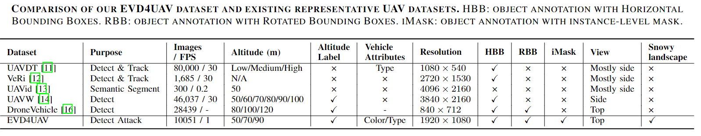

# Introduction

Welcome to the EVD4UAV dataset repository! EVD4UAV is an altitude-sensitive benchmark dataset designed to evade vehicle detection in Unmanned Aerial Vehicle (UAV) imagery. This dataset is specifically curated to facilitate the study of adversarial patch-based vehicle detection attacks in UAV images. The EVD4UAV dataset comprises a diverse set of images captured at various altitudes with fine-grained annotations, making it a robust platform for evaluating the performance of object detectors under adversarial conditions. Notably, the dataset includes around 3,000 images depicting winter scenarios where vehicles may be partially or fully covered by snow, providing a unique challenge for vehicle detection algorithms.


# Dataset Overview


You can download the data through [google drive](https://drive.google.com/file/d/1OZwBZC_WpfLwgJs74Sop_kLxVZre25fq/view?usp=sharing)

## Anootation
- Bounding Boxes: Both horizontal and rotated bounding boxes to provide precise localization of vehicles.
- Instance-Level Masks: Detailed segmentation masks for each vehicle.
- Vehicle Attributes: Information on vehicle color and type.


## Key Features
- Total Images: 10051
- Annotated Vehicles: 245,518
- Altitudes: 50m, 70m, 90m
- Resolution: 1920*1080
- Colors: Black, Blue, Brown, Gray, Green, Red, Silver, White, Yellow and Unknown
- Types: Car, Bus, Truck
- View: Top-view images with clear vehicle roofs
## Applications
Vehicle detection
- Study of adversarial patch-based attacks on object detectors
- Evaluation of altitude-insensitive detection performance
## Data Collection
The EVD4UAV dataset was collected using DJI Mini3 Pro UAVs, capturing images from three different altitudes (50m, 70m, and 90m) above the ground. The images were taken in California and Ohio, USA, encompassing various scenes such as urban roads, highways, parking lots, and residential areas. Each image contains multiple vehicles, annotated with detailed attributes and fine-grained instance-level masks with the help of Fast-SAM and LlavaNext. 


## Citation
If you use the EVD4UAV dataset in your research, please cite the following paper:
```
@article{sun2024evd4uav,
  title={EVD4UAV: An Altitude-Sensitive Benchmark to Evade Vehicle Detection in UAV},
  author={Sun, Huiming and Guo, Jiacheng and Meng, Zibo and Zhang, Tianyun and Fang, Jianwu and Lin, Yuewei and Yu, Hongkai},
  journal={arXiv preprint arXiv:2403.05422},
  year={2024}
}
```
